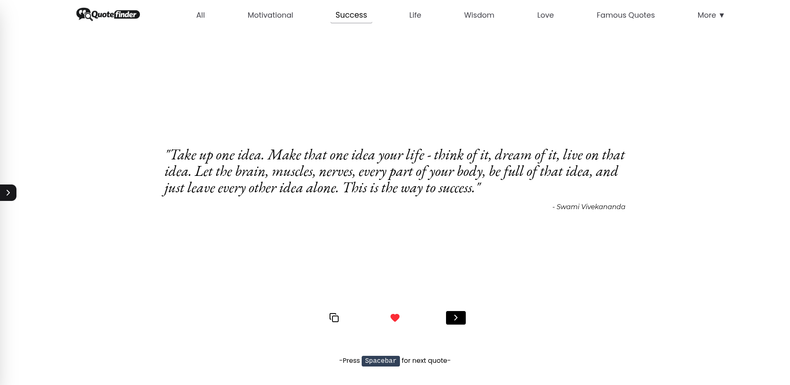
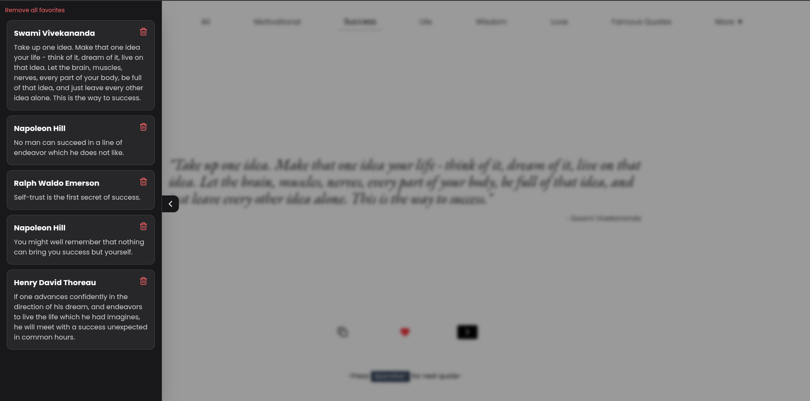
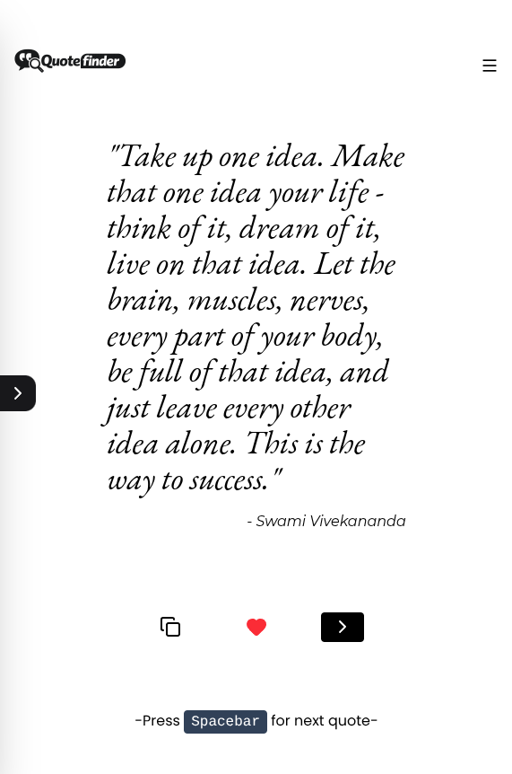
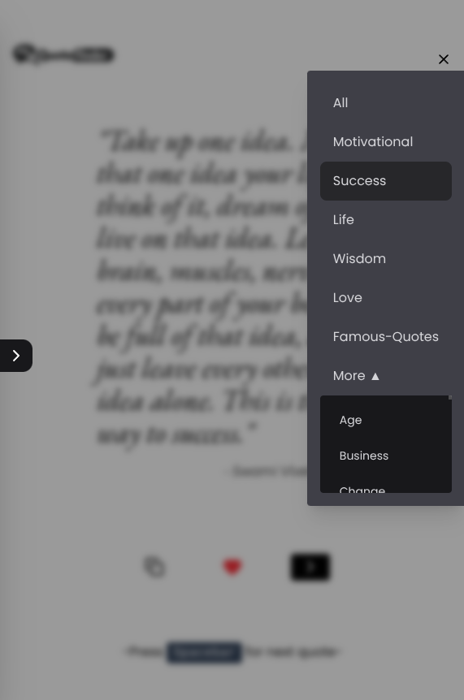

<div align="center">


# Quote Finder

Discover inspiring quotes from a variety of categories, save your favorites, and copy them with a single click.

## Live Demo

https://quote-finder-beta.vercel.app/



</div>

---

## Features

- Fetch random quotes instantly
- Browse quotes by category
- "More" dropdown for additional categories
- Add and remove favorite quotes
- Copy quotes to the clipboard
- Press **Spacebar** to fetch the next quote
- Persists the current quote, selected category, and favorites using Local Storage
- Responsive design for desktop and mobile

---

## Built With

- React
- Vite
- Tailwind CSS
- JavaScript (ES6+)
- Lucide React
- React Toastify
- Quotable API

---

## Getting Started

Clone the repository

```bash
git clone https://github.com/Rahul-Vashistt/quote-finder.git
```

Navigate to the project directory

```bash
cd quote-finder
```

Install dependencies

```bash
npm install
```

Start the development server

```bash
npm run dev
```

Build for production

```bash
npm run build
```

---

## Project Structure

```text
src
│
├── assets
│   ├── preview.png
│   └── quote-finder-logo.png
│
├── components
│   ├── Header.jsx
│   ├── DesktopHeader.jsx
│   ├── MobileHeader.jsx
│   ├── QuoteActions.jsx
│   ├── QuoteDisplay.jsx
│   └── FavoritesDrawer.jsx
│
├── utils
│   ├── copyToClipboard.js
│   └── formatValue.js
│
├── App.jsx
└── main.jsx
```

---

## Keyboard Shortcut

| Key | Action |
|------|--------|
| Spacebar | Fetch the next quote |

---

## Preview






---

## Author

**Rahul Vashist**

GitHub: https://github.com/Rahul-Vashistt

---

## Support

If you enjoyed this project, consider giving it a star on GitHub.